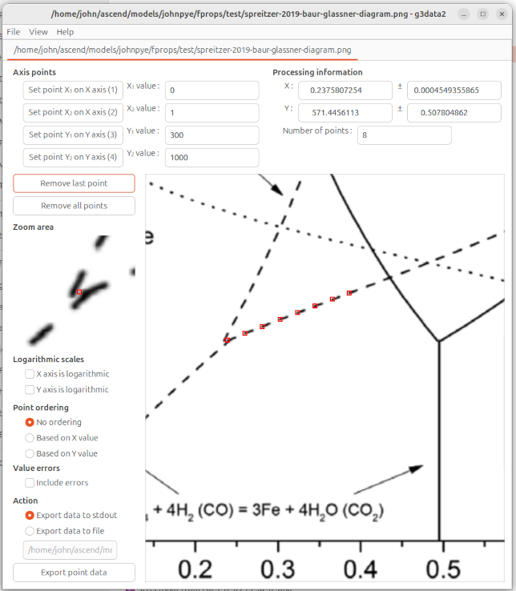

# What is g3data2?



g3data2 is a tool for extracting data from scanned graphs. For graphs published in scientific articles the actual data is often not
explicitly given; g3data makes the process of extracting this data fairly easy and fairly accurate.

Original 'g3data' source (GTK2 version): http://github.com/pn2200/g3data/
Fork 'g3data2' for GTK3: https://github.com/jonasfrantz/g3data2
New fork, same terrible name: https://github.com/jdpipe/g3data2

# Building from source

Install GTK3 devel packages for your distro as well as SCons (www.scons.org). Then run 'scons' to build the tool. You can run it from your working directory.

On Ubuntu 24.04, this would be

```sh
sudo apt install libgtk-3-dev scons
git clone https://github.com/jdpipe/g3data2.git
cd g3data2
scons
./g3data2
```

# Using the program

It's fairly self-explanatory. But to be explicit:

* you first have to identify the left and right end of your x and y axes in the plot. This sets the transformation from pixel to data coordinates
* next you click points in the graph, amassing a list of points that can be either output to stdout or output to a `.dat` text file that you can name.
* note that you can zoom in using ctrl-wheel, pan up and down with the mouse wheel, and pan left and right with shift-wheel.
* zooming in is a good idea when selecting points. g3data2 has sub-pixel precision for identifying and working with point data.
* if you want to extract multiple curves from the same plot, you can save your points, then change the file name, click 'remove all points', and start again.
* g3data2 will remember your recent files, which is useful because you never get this stuff right first time.
* once you have your data file, consider using fityk to do the curve fitting! one you get used to it, it's very powerful!

# Recent changes

* Added main-pane zoom to allow better precision when selecting points
* Added pixel-value calculations based double-precision arithmetic rather than integers
* Implements SCons build script instead of bare Makefile

# Roadmap

* Implement packaging for Ubuntu/elsewhere (help needed!)
* Ability to store multiple curves from a single plot without having to start again
* Ability to remove points selectively (graphically)
* Less clicking for initial x1/x2/y1/y2 selection
* Ability to force orthogonality (eg when no rotation of the image is possible due to its provenance)
* Implement smart curve tracing?

# License

g3data2 is distributed under the GNU General Public License (GPL), as
described in the 'COPYING' file.

John Pye, Feb 2026
