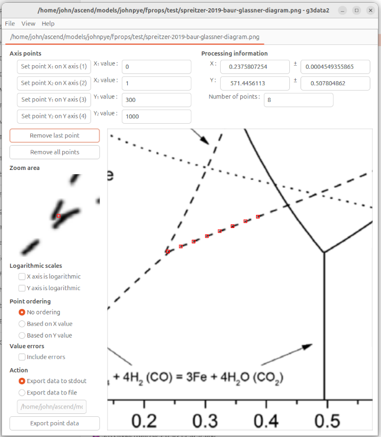

# What is g3data2?



g3data2 is a tool for extracting data from scanned graphs. For graphs published in scientific articles the actual data is often not
explicitly given; g3data makes the process of extracting this data fairly easy and fairly accurate.

Original 'g3data' source (GTK2 version): http://github.com/pn2200/g3data/
Fork 'g3data2' for GTK3: https://github.com/jonasfrantz/g3data2
New fork, same terrible name: https://github.com/jdpipe/g3data2

# Building from source

Install the GTK3 and SQLite development packages for your distro, as well as
SCons (www.scons.org). Then run `scons` to build the tool. CUnit is optional;
when available, `scons test` builds and runs the datastore/model tests.

On Ubuntu 24.04, this would be

```sh
sudo apt install libgtk-3-dev libsqlite3-dev libcunit1-dev scons
git clone https://github.com/jdpipe/g3data2.git
cd g3data2
scons
./g3data2
```

# Using the program

It's fairly self-explanatory. But to be explicit:

* you first have to identify the left and right end of your x and y axes in the plot. This sets the transformation from pixel to data coordinates
* next you click points in the graph, amassing a list of points that can be copied to the clipboard, output to stdout, or written to a `.dat` file chosen through a save dialog. These actions are under the **File** menu for either the current series or all series. Point ordering and inclusion of error columns are persistent export options in the same menu.
* sampled points are kept as double-precision image pixel coordinates. Data coordinates are recalculated from the current axis calibration whenever they are displayed or exported.
* each image can have several named, coloured series. Use the series selector to choose the active series; new points are added to it and export outputs that series.
* switch to **Select / edit points** to inspect or drag a point. Shift-click markers to add or remove them from a multi-point selection. The **Edit** menu removes the last point, clears the current series, or deletes the selected point(s); Delete and Backspace also delete the selection while the image has focus. Inactive visible series remain on screen in muted colours.
* images initially use **Zoom to fit**. This remains active across window resizing and maximising until you manually zoom or pan, or choose another zoom level. You can zoom using ctrl-wheel, pan up and down with the mouse wheel, and pan left and right with shift-wheel. Smaller images can be enlarged to 16×; the maximum is reduced automatically for large images to keep the scrollable canvas within a safe size.
* zooming in is a good idea when selecting points. g3data2 has sub-pixel precision for identifying and working with point data.
* calibration, series, and sampled positions are saved automatically in `~/.local/share/g3data2/g3data2.sqlite3`. Reopening the same image content restores them, even after the image file is renamed or moved.
* clipboard exports use tab-separated columns, so they paste directly into spreadsheet cells in applications such as LibreOffice Calc.
* g3data2 will remember your recent files, which is useful because you never get this stuff right first time.
* once you have your data file, consider using fityk to do the curve fitting! one you get used to it, it's very powerful!

# Recent changes

* Added main-pane zoom to allow better precision when selecting points
* Added pixel-value calculations based double-precision arithmetic rather than integers
* Added persistent calibration and multi-series point storage using SQLite
* Added graphical point selection, movement, and deletion
* Implements SCons build script instead of bare Makefile

# Roadmap

* Implement packaging for Ubuntu/elsewhere (help needed!)
* Portable project databases and database snapshots
* Less clicking for initial x1/x2/y1/y2 selection
* Ability to force orthogonality (eg when no rotation of the image is possible due to its provenance)
* Implement smart curve tracing?

# License

g3data2 is distributed under the GNU General Public License (GPL), as
described in the 'COPYING' file.

John Pye, Feb 2026
